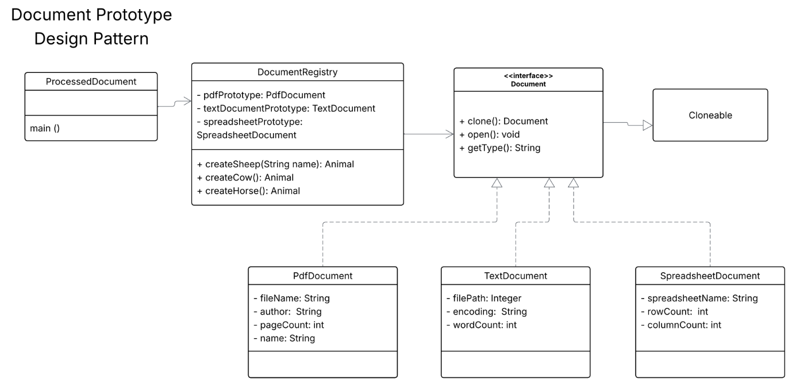

# Document Prototype Design Pattern

## Overview
This program implements the Prototype Design Pattern for document management. The pattern allows for creating new objects by copying existing ones (prototypes) instead of creating them through constructors.



## Components

### Document Interface
- Base interface that extends Cloneable
- Defines methods: clone(), open(), getType()

### Concrete Document Classes
- **PdfDocument**: PDF document with fileName, author, pageCount, name
- **TextDocument**: Text document with filePath, encoding, wordCount
- **SpreadsheetDocument**: Spreadsheet with spreadsheetName, rowCount, columnCount

### DocumentRegistry
- Manages document prototypes
- Creates new document instances by cloning prototypes
- Contains methods: createPdfDocument(), createTextDocument(), createSpreadsheetDocument()

### ProcessedDocument
- Contains the main method to demonstrate the pattern
- Shows how to create and clone document objects

## Output
When you run the program, you'll see:
```
Creating a PDF Document prototype.
Creating a Text Document prototype.
Creating a Spreadsheet Document prototype.
Opening PDF Document: annual_report_2024.pdf by Acme Corp (150 pages)
Type: PDF, File: annual_report_2024.pdf, Author: Acme Corp, Pages: 150
Opening Text Document: meeting_notes.txt with encoding: UTF-8 (250 words)
Type: Text, Path: meeting_notes.txt, Encoding: UTF-8, Words: 250
Opening Spreadsheet Document: sales_data_q1.xlsx (1000 rows, 20 columns)
Type: Spreadsheet, Name: sales_data_q1.xlsx, Rows: 1000, Columns: 20
Opening PDF Document: summary_report.pdf by Acme Corp (30 pages)
```

## Benefits
- Reduces cost of object creation. Why create when you can clone?
- Creates objects without knowing their specific types
- Allows for customization after cloning

*No documents were harmed in the making of this pattern. All cloning was performed by trained professional objects.*
